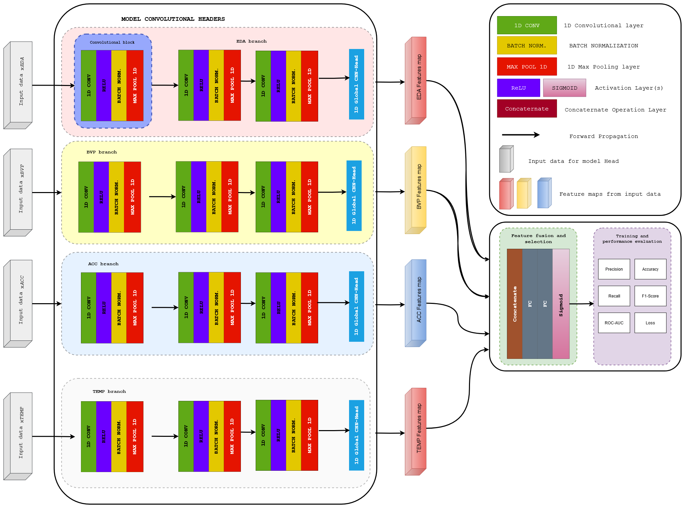

<a id="readme-top"></a>
<br />
<div align="center">

  <h3 align="center">Convolutional Neural Network on Physiological Signals for Stress Detection</h3>

  <p align="center">
    A CNN model for the Stress Wearables use case.
    <br />
</div>




## About this project
This repository contains the code, data, and configurations for a research study investigating the use of Convolutional Neural Networks (CNNs) to analyze physiological signals for stress assessment. The study focuses on four key modalities: Electrodermal Activity (EDA), Blood Volume Pulse (BVP), Accelerometer (ACC) data, and Skin Temperature (Skin Temp).

The project contains a developed one-dimensional Convolutional Neural Network (1D CNN) tailored for analyzing these time-series signals. The model outputs a sigmoid probability, enabling accurate binary classification of stress and non-stress states. To ensure reproducibility, the study utilized Data Version Control (DVC) to systematically track code, dataset versions, model hyperparameters, and experimental configurations. 
## Research Objectives
The primary goals of this research are:
- **Understanding** physiological signals: Explore the relationship between stress levels and measurable changes in EDA, BVP, ACC, and Skin Temp data.
- **Developing a detection model**: Use CNNs to process and analyze the time-series data for stress detection.
- **Reproducibility and collaboration**: Ensure all data processing, modeling, and experimentation are reproducible through the use of Data Version Control (DVC).

## Used Technologies
<div align="center">
    
    
    
    
    
    
    
    
</div>

## Getting Started

1. **Clone the repository:**
    ```bash
    git clone git@projects.fhict.nl:ai-en-big-data-lectoraat/streaming-wearables-and-stress-measurement-platform/convolutional-neural-network-on-multimodal-data-for-stress-assessment.git
    ```

2. **Install dependencies:**
    ```bash
    pip install -r requirements2.txt
    ```

3. **Setup DVC and data:**
Please refer to the [Handover MD](https://projects.fhict.nl/ai-en-big-data-lectoraat/streaming-wearables-and-stress-measurement-platform/convolutional-neural-network-on-multimodal-data-for-stress-assessment/-/blob/main/handover.md?ref_type=heads).

4. **Train the model:**
    - Open `notebooks/stressModel.py` and run the python code to train the model.

### Workflow with DVC

- **Data Handling**: DVC tracks changes to large datasets, storing them in external storage while referencing them in Git.
- **Experiment Reproducibility**: By using DVC pipelines, you can recreate past experiments by pulling the exact data and models that were used.
- **Collaboration**: Multiple developers can collaborate on the same project by using DVC to share data and models easily, while Git handles code versioning.

## Key Features

- **Data Versioning**: Use DVC to manage and version datasets.
- **Model Versioning**: Track different versions of models throughout the training process.
- **Experiment Tracking**: DVC ensures that all your experiments are reproducible, from data through model training and evaluation.

## Recommendations 
- [ ] Conduct further hyperparameter tuning to improve model accuracy.
- [ ] Apply SoftMax as output layer with 2 neurons: (no-stress & stress) for probabillity in both classes. So, GRADCAM can be applied on both classes.
- [ ] Explore additional physiological signals for enhanced stress detection.
- [ ] Implement real-time stress monitoring using the trained model.
- [ ] Validate the model on a larger and more diverse dataset.
- [ ] Expand DVC with more pipeline options.

## Information About Used Hardware and Software Specs:
### Hardware: 
- **CPU**: AMD Ryzen 2700x
- **GPU**: NVIDIA GeForce RTX 2060 Super with CUDA activated.
- **Storage**: 50-100 GB of SSD
- **RAM**: 32GB DDR4

### Software:
- Windows 11 Home
- Python 3.9.18
- Numpy: 1.26.4
- Pandas: 2.2.2
- DVC: 3.55.2
- DVC-azure: 3.1.0 


