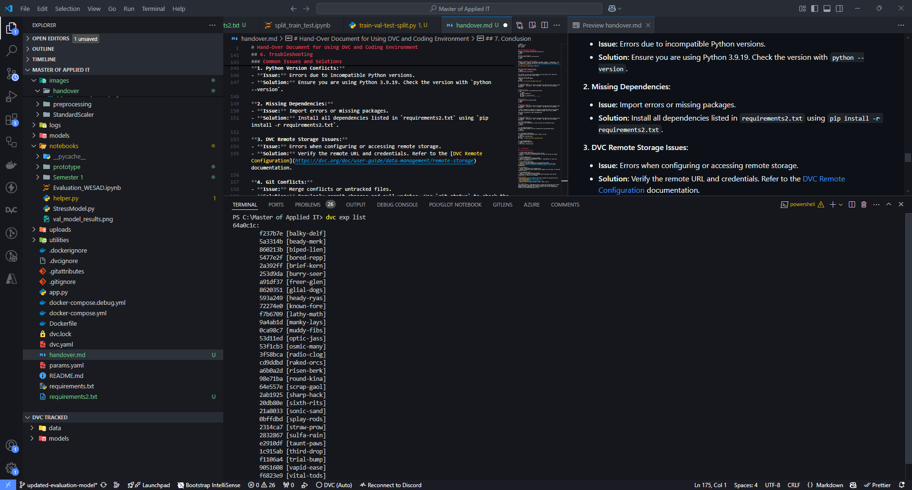

# Hand-Over Document for Using DVC and Coding Environment

## Introduction
This document provides a guide on setting up and using the DVC (Data Version Control) system alongside a Python coding environment. The instructions are tailored for Python 3.9.19 but can be adapted to other versions if needed. However, some packages might require a legacy version.

## 2. Prerequisites
-  ```Python 3.9.19 installed on your system.```
- ```Git installed and configured```
- [DVC installed](https://dvc.org/#get-started-dvc)

## 3. Environment Setup
### Step 1. Install Python
Ensure Python 3.9.19 is installed. You can download it from the official Python website: https://www.python.org/.

### Step 2. Create a Virtual Environment
Creating a virtual environment ensures dependencies are isolated.

```python
python3.9 -m venv dvc_env
```
In order to activate the virtual environment, make sure select the right python interpreter. This can be done by ```ctrl + shift + p``` and type in ```python interpreter```.


### Step 3. Install Required Libraries
Use ```pip``` to install essential packages, including DVC.

```python
pip install --upgrade pip
pip install -r requirements2.txt  # Includes all necessary dependencies for DVC
```
Make sure to install requirements2.txt. This file is all the required packages you will need to get started. 

> **Python Warning:** Ensure that you are using the correct version of Python and that all dependencies are compatible with Python 3.9.19. Using different versions may cause unexpected issues.

> **Requirements.txt:** Please use `requirements2.txt` for setting up your local environment. The `requirements.txt` file is intended for the CI pipeline and is not suitable for local development.

### Step 4: Verify Installation
Confirm that Python, pip, and DVC are correctly installed.
```python
python --version   
pip --version
dvc --version
```

## 4. Setting Up DVC in Your Project.
### Step 1: Initialize a Git Repository
Navigate to your project directory and initialize Git.
```python
git init
```
### Step 2: Initialize DVC
Run the following command to initialize DVC.
```python
dvc init
```

### Step 3: Configure a Remote Storage
Configure remote storage to track datasets and models. Replace ```<remote_name>``` and ```<remote_url>``` with your storage URL. Check this documentation for more details: [DVC Remote Configuration](https://dvc.org/doc/user-guide/data-management/remote-storage)
```
dvc remote add -d <remote_name> <remote_url>
```

### Step 4: Add and Track Data Files
Track large files or datasets with DVC.
```python
dvc add <data_file_or_directory>
```

This creates .dvc files that record metadata. And a git ignore file to ignore the tracked files by DVC for GIT version control.

### Step 5: Commit Changes
Commit both Git and DVC changes.
```python
git add .
git commit -m "Set up DVC and added initial data"
```

## 5. Working with DVC
> **Important!** Make sure to save your progress/files under GIT version control. Using DVC commands: ```dvc exp run``` and ```dvc repro``` has some risks if not handled carefully.


### Adding New Data
1. Place the new data in the appropriate directory.
2. Run:
    ```python
    dvc add <new_data_file>
    git add .
    git commit -m "Added new data"
    dvc push  # Uploads data to remote storage
    ```

### Pulling Data
To fetch data from the remote storage:
```python
dvc pull
```

### Reproducing Pipelines
> **Important!** Make sure to save your progress/files under GIT version control. Using DVC commands: ```dvc exp run``` and ```dvc repro``` has some risks if not handled carefully. 

> **Note:** Running this command will reproduce the experiment based on the committed code, which overwrite and discard any uncommitted changes in your local codebase.

Define and run pipelines to ensure reproducibility.
```python
dvc repro
```

### Get List of Experiments
Use the following command to list all experiments in the codebase:
```
dvc exp list
```



### Managing Experiments
> **Important!** Make sure to save your progress/files under GIT version control. Using DVC commands: ```dvc exp run``` and ```dvc repro``` has some risks if not handled carefully. 

**1. Create an Experiment:**
Modify your code, configuration, or data, and then run the experiment using:
```python
dvc exp run
```

**2. View Experiment Results:**
Use the following command to see the tracked metrics and experiment details:
```python
dvc exp show
```

**3. Save Important Experiments:**
If an experiment yields promising results, commit it to Git:
```python
dvc exp apply <experiment_name>
git add .
git commit -m "Applied experiment <experiment_name>"
```

**4. Clean Up Experiments:**
To remove unneeded experiments:
```python
dvc exp remove <experiment_name>
```

## 5.1. Using DVCLive for Experiment Tracking
DVCLive is a lightweight tool for live-tracking machine learning metrics and other parameters during training. It integrates seamlessly with DVC and helps in visualizing the progress of your experiments.

### Step 1: Install DVCLive
Install DVCLive using pip:
```python
pip install dvclive
```

### Step 2: Integrate DVCLive in Your Code
Add DVCLive to your training script to start tracking metrics. Here is an example for a training loop:
```python
from dvclive import Live

live = Live()

for epoch in range(num_epochs):
    # Training code here
    train_loss = ...
    val_loss = ...
    
    # Log metrics
    live.log_metric("train_loss", train_loss)
    live.log_metric("val_loss", val_loss)
    
    # Save checkpoint
    live.next_step()
```

### Step 3: Visualize Metrics
DVCLive automatically logs metrics to a `dvclive` directory. You can visualize these metrics using DVC:
```python
dvc plots show
```

### Step 4: Commit and Push Changes
After running your experiment, commit the changes and push them to your remote repository:
```python
git add .
git commit -m "Tracked metrics with DVCLive"
dvc push
```

By integrating DVCLive, you can easily monitor and visualize the performance of your machine learning experiments in real-time.


## 6. Troubleshooting

### Common Issues and Solutions

**1. Python Version Conflicts:**
- **Issue:** Errors due to incompatible Python versions.
- **Solution:** Ensure you are using Python 3.9.19. Check the version with `python --version`.

**2. Missing Dependencies:**
- **Issue:** Import errors or missing packages.
- **Solution:** Install all dependencies listed in `requirements2.txt` using `pip install -r requirements2.txt`.

**3. DVC Remote Storage Issues:**
- **Issue:** Errors when configuring or accessing remote storage.
- **Solution:** Verify the remote URL and credentials. Refer to the [DVC Remote Configuration](https://dvc.org/doc/user-guide/data-management/remote-storage) documentation.

**4. Git Conflicts:**
- **Issue:** Merge conflicts or untracked files.
- **Solution:** Regularly commit changes and pull updates. Use `git status` to check the repository status.

**5. DVC Command Failures:**
- **Issue:** Errors when running DVC commands.
- **Solution:** Ensure DVC is correctly installed and initialized. Check the DVC documentation for specific error messages.

### Getting Help
If you encounter issues not covered in this guide, consider the following resources:
- [DVC Documentation](https://dvc.org/doc)
- [Python Documentation](https://docs.python.org/3/)
- [Git Documentation](https://git-scm.com/doc)
- Community forums and support channels for DVC, Python, and Git.

For additional help, if issues persists, you may contact the author of this document.

## 7. Conclusion
This document provides a comprehensive guide to setting up and using DVC with a Python coding environment. Following these steps will help ensure a smooth workflow for managing data and experiments. For further assistance, refer to the troubleshooting section or the provided documentation links.

